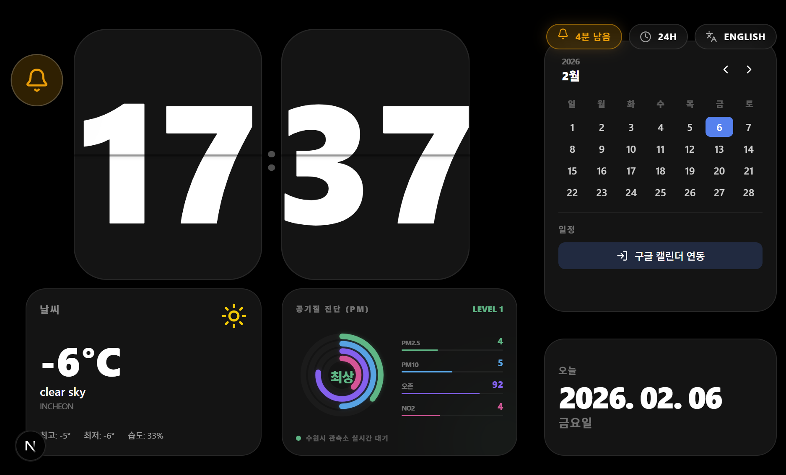

# 🕒 WebDeskClock (웹 데스크 클락)

**WebDeskClock**은 사용자의 데스크테리어(Deskterior)를 완성해주는 프리미엄 웹 기반 데스크 시계 및 일정 관리 대시보드입니다. 모던한 디자인, 실시간 정보 제공, 그리고 편리한 접근성을 한데 담았습니다.

---


## ✨ 핵심 기능

- **플립 시계 (Flip Clock)**: 아날로그 감성의 디지털 플립 시계로 가독성 높은 시간을 제공합니다. (Framer Motion 기반 애니메이션)
- **실시간 날씨 위젯**: 현재 온도, 날씨 상태(아이콘), 최고/최저 기온, 습도 정보를 실시간으로 제공합니다.
- **대기질 지수 (AQI)**: 미세먼지(PM10) 및 초미세먼지(PM2.5) 수치를 분석하여 상태를 직관적으로 표시합니다.
- **캘린더 위젯**: 월별 일정 관리 및 오늘 날짜 표시 기능을 포함한 콤팩트한 달력을 제공합니다.
- **구글 캘린더 연동**: 버튼 하나로 Google Calendar와 동기화하여 다가오는 일정을 확인할 수 있습니다.
- **다국어 지원 (Bilingual Context)**: 한국어와 영어 간의 실시간 언어 전환 버튼을 상단에 제공합니다.
- **PWA (Progressive Web App)**: 브라우저 인터페이스 없이 독립된 앱처럼 설치하여 사용할 수 있으며, 프레임리스 윈도우 모드와 드래그 이동 기능을 지원합니다.


<div style="
display: flex; 
gap: 10px; 
align-items: 
flex-start;"
>


</div>


---


## 🚀 테크 스택

- **Framework**: [Next.js (App Router)](https://nextjs.org/)
- **Styling**: [Tailwind CSS v4](https://tailwindcss.com/)
- **State Management**: [Redux Toolkit](https://redux-toolkit.js.org/)
- **Animations**: [Framer Motion](https://www.framer.com/motion/)
- **Icons**: [Lucide React](https://lucide.dev/)
- **Authentication**: [NextAuth.js](https://next-auth.js.org/) (for Google Calendar)

---


## 🛠️ 설치 및 실행 방법

### 1. 프로젝트 클론 및 의존성 설치
```bash
git clone <repository-url>
cd calendar-clock
npm install
```

### 2. 환경 변수 설정
`.env.local` 파일을 생성하고 필요한 API 키를 설정합니다 (Weather API, Google OAuth 등).

### 3. 개발 서버 실행
```bash
npm run dev
```
브라우저에서 `http://localhost:3000` 접속 시 확인 가능합니다.

---


## 📱 PWA 설치 및 데스크탑 앱처럼 사용하기

본 프로젝트는 설치형 웹 앱(PWA) 기능을 완벽하게 지원합니다.

1. **설치 방법**: Chrome 또는 Edge 브라우저 주소창 우측의 **'설치'** 아이콘을 클릭하거나 메뉴에서 **'앱 설치'**를 선택하세요.
2. **독립 실행**: 설치된 앱을 실행하면 브라우저 제어 도구(주소창, 탭 등)가 없는 깔끔한 **풀스크린/프레임리스 모드**로 실행됩니다.
3. **창 이동**: 화면 어느 곳이든 클릭하여 드래그하면 창을 자유롭게 이동할 수 있습니다. (데스크탑 위젯처럼 활용 가능)

---


## 📂 프로젝트 구조

```text
src/
├── app/              # Next.js App Router (Layout, Page, Global CSS)
├── components/       # 재사용 가능한 UI 컴포넌트
│   ├── calendar/     # 달력 관련 컴포넌트
│   ├── clock/        # 플립 시계 컴포넌트
│   ├── common/       # Providers, LanguageToggle 등 공통 요소
│   └── weather/      # 날씨 및 AQI 위젯
├── hooks/            # 커스텀 훅 (useWeather 등)
└── store/            # Redux Toolkit 설정 및 Slice 관리
```

---


## 💅 디자인 아이덴티티

- **Glassmorphism**: 반투명 배경과 블러 처리를 통한 세련된 카드 레이아웃.
- **Premium Dark Mode**: 시각적 피로도를 줄이는 딥 블랙 배경과 비비드한 포인트 컬러.
- **Micro-interactions**: 버튼 호버, 텍스트 상호작용 등 부드러운 애니메이션 적용.

---


## 📜 라이선스

이 프로젝트는 개인 학습 및 커스터마이징을 위해 자유롭게 사용 및 수정이 가능합니다.

---


## 📝 릴리즈 노트 (Release Notes)

### **v1.1.0 (2026-02-06)**
- **하이드레이션 오류 해결**: 서버와 클라이언트 간의 날짜/시간 불일치로 인한 *Hydration Failed* 오류를 `mounted` 상태 관리를 통해 완벽히 해결했습니다.
- **다국어 지원 시스템 도입**: 한국어와 영어 간의 실시간 전환 기능을 추가했습니다. (Redux 전역 상태 관리 및 `LanguageToggle` 컴포넌트 추가)
- **캘린더 UI 최적화**: 날짜 그리드의 수직 간격을 줄여 더욱 콤팩트한 레이아웃을 구현하고, 일정 연동 버튼의 위치를 상단으로 조정했습니다.
- **PWA 사용자 경험 개선**:
  - `display: fullscreen` 설정을 통해 브라우저 헤더를 완전히 제거했습니다.
  - `-webkit-app-region: drag` 설정을 추가하여 프레임리스 창 모드에서도 본문의 빈 공간을 드래그하여 창을 자유롭게 이동할 수 있도록 개선했습니다.
- **기타 수정**: 요일 계산 로직 수정 및 전체적인 UI 텍스트 번역 완성도를 높였습니다.

